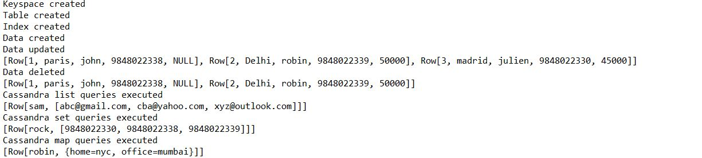

# CassandraCRUD
CRUD cassandra (CQL) with java.

Very basic examples to interact with Cassandra NoSql database using java. 

For installation of cassandra server: http://www.datastax.com/2012/01/getting-started-with-apache-cassandra-on-windows-the-easy-way

## Run

First clone this app and start your cassandra server. Then run:

 `mvn exec:java`
 
## Output 
 

